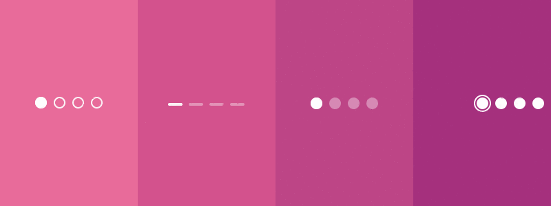

# react-native-chi-page-control

Cool page control with custom animations written in React Native and inspired by Native iOS framework [CHIPageControl](https://github.com/ChiliLabs/CHIPageControl)



## Installation

Using npm:

`$ npm install react-native-chi-page-control --save`

Using yarn:

`$ yarn add react-native-chi-page-control`

## Usage

```js
import { 
  PageControlAji,
  PageControlAleppo,
  PageControlJaloro,
  PageControlPoblano 
} from 'react-native-chi-page-control';

<PageControlAji progress={0.5} numberOfPages={3} />
<PageControlAleppo progress={0.5} numberOfPages={3} />
<PageControlJaloro progress={0.5} numberOfPages={3} />
<PageControlPoblano progress={0.5} numberOfPages={3} />
```

## Examples

  [FlatList](./examples/FlatListExample.js)
  <br />
  [react-native-swiper](./examples/SwiperExample.js)

## Properties for all components

| Prop                                 | Description                                                               | Default |
| ------------------------------------ | ------------------------------------------------------------------------- | ------- |
| **`numberOfPages`**                  | Number of pages show in page control.                                     | `0`     |
| **`progress`**                       | Progress of page. A number between 0 and 1.                               | `0`     |
| **`animationDuration`**              | Page scroll animation speed.                                              | `50`    |
| **`margin`**                         | Space between pages.                                                      | `6`     |
| **`activeTintColor`**                | Color of moving page.                                                     | `black` |
| **`hidesForSinglePage`**             | If set true then if page control will have one page, will be hidden.      | `true`  |

## PageControlAji  &  PageControlAleppo

All of the props under _Properties_ in addition to the following:

| Prop                                 | Description                                                               | Default |
| ------------------------------------ | ------------------------------------------------------------------------- | ------- |
| **`radius`**                         | Page radius.                                                              | `6`     |
| **`inactiveTransparency`**           | Inactive page opacity.                                                    | `0.4`   |
| **`inactiveBorderColor`**            | Inactive page border color.                                               | _None_  |
| **`inactiveTintColor`**              | Inactive page color.                                                      | `black` |

## PageControlJaloro

All of the props under _Properties_ in addition to the following:

| Prop                                 | Description                                                               | Default |
| ------------------------------------ | ------------------------------------------------------------------------- | ------- |
| **`width`**                          | Width of page.                                                            | `15`    |
| **`height`**                         | Height of page.                                                           | `6`     |
| **`borderRadius`**                   | Page border radius.                                                       | `3`     |
| **`inactiveTransparency`**           | Inactive page opacity.                                                    | `0.4`   |
| **`inactiveTintColor`**              | Inactive page color.                                                      | `black` |


## PageControlPoblano

All of the props under _Properties_ in addition to the following:

| Prop                                 | Description                                                               | Default |
| ------------------------------------ | ------------------------------------------------------------------------- | ------- |
| **`radius`**                         | Page radius.                                                              | `6`     |
| **`activeTransparency`**             | Page view opacity.                                                        | `1`     |
| **`inactiveBorderColor`**            | Inactive page color.                                                      | `black` |

## Page Controls 🌶️🌶️🌶️

 PageControlAji

 PageControlAleppo

 PageControlJaloro

 PageControlPoblano

## License

[MIT](./LICENSE)
